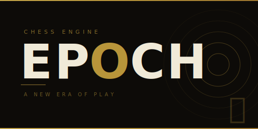

<p align="center">
  
</p>

# Epoch

**Epoch** is an open-source chess engine written in C++ by Daniel C. Homan, an astrophysicist at Denison University in Granville, Ohio.  Originally developed under the name **EXchess**, development began in the late 1990s and the engine was actively maintained and released through early 2017.  After a long hiatus, the project was restarted in 2026 with significant new features developed in collaboration with [Claude Code](https://claude.ai/claude-code) (Anthropic) and renamed to Epoch.

---

## History

EXchess (now Epoch) first appeared around 1997–1998 and was one of a handful of serious open-source engines of that era.  Over two decades of on-and-off development produced a series of increasingly capable versions — from the early v2/v3 series through the v6 and v7 lines released in 2011–2017.

The engine is written in C++, licensed under the GNU Public License, and communicates via the Chess Engine Communication Protocol (xboard/Winboard).  It includes a classical hand-crafted evaluation function, principal variation search (PVS), null-move pruning, late move reductions, static exchange evaluation, history heuristics, and a lazy SMP work-sharing implementation that achieves roughly 1.65× speedup on 2 threads and 2.5× on 4 threads.  An early form of Temporal Difference (TD-leaf) learning for evaluation tuning was present in older releases.

The final pre-hiatus release was **v7.97b** (February 2017), rated around **2,772 Elo** on CCRL 40/40.  After that, development went quiet for approximately eight years.

More history and technical background can be found on the [Chessprogramming wiki](https://www.chessprogramming.org/EXchess) and the [Daniel Homan](https://www.chessprogramming.org/Daniel_Homan) author page.

---

## 2026 Restart — Collaboration with Claude Code

In early 2026 the project was restarted with a focus on two major new capabilities: a **Stockfish-compatible NNUE evaluation** and a **TDLeaf(λ) online learning** system that can train the NNUE weights from self-play.

This work was developed interactively with [Claude Code](https://claude.ai/claude-code), Anthropic's AI coding assistant.  The collaboration covered design, implementation, debugging, and tuning — from the initial NNUE forward-pass implementation through to verifying the evaluation matched Stockfish 15.1 exactly and training the network from self-play games.

---

## New Features

### NNUE Evaluation

Epoch supports **HalfKAv2_hm** NNUE evaluation compatible with Stockfish 15.1 era networks.  Build with `NNUE=1`.

The current default network file, **`nn-ad9b42354671.nnue`** is the original Stockfish 15.1 release network and serves three distinct purposes in the project:

**1. Implementation correctness anchor.**
Because this is the exact network shipped with Stockfish 15.1, Epoch's forward pass can be validated against the Stockfish 15.1 source line by line.  Any discrepancy in evaluation of a given position is a bug in Epoch, not an approximation.  This property was used extensively during development: several significant bugs were isolated and fixed by comparing Epoch evaluation against Stockfish on the same position, including an incorrect feature index for the own king, a wrong SqrCReLU formulation that zeroed all negative pre-activations, and an incorrect PSQT scale factor.  After all fixes, Epoch matches Stockfish 15.1 evaluation exactly (within 1 cp rounding) on every tested position.

**2. Playing-strength baseline.**
A network trained from scratch by Epoch itself (via TDLeaf(λ) self-play) will initially be weaker than `nn-ad9b42354671.nnue`, which represents years of Stockfish training data.  Match results against the Stockfish net provide the clearest measure of training progress: the goal is to close the gap, then surpass it with a network tuned to Epoch's own search characteristics.  Current result with the SF15.1 net: **92W–8D–0L (96.0%)** vs the classical Epoch eval at 10+0.1s/move.

**3. Weight initialisation for fresh training.**
Epoch can generate a fresh `.nnue` with `--init-nnue --write-nnue <file>`.  FC and FT weights are sampled from Gaussian distributions measured from the SF15.1 network; all biases are zero; PSQT is set to classical piece values.

| Layer | Initialisation |
|-------|---------------|
| FC0 weights | N(0.24, 8.43), truncated ±127 |
| FC1 weights | N(−1.10, 18.30), truncated ±127 |
| FC2 weights | N(1.10, 30.0), truncated ±127 (ref σ=76.38 reduced; see note below) |
| FC/FT biases | 0 (zero) |
| FT weights (int16) | N(−0.71, 44.41) |
| PSQT | Classical piece values: Pawn=5,776; Knight=21,776; Bishop=23,046; Rook=34,425; Queen=69,144; King=0 (units: cp × 5776/100), signed ± by perspective |

All int8 weights use **rejection sampling** (truncated Gaussian): samples outside ±127 are discarded and redrawn rather than clipped, avoiding artificial density spikes at the int8 boundaries.  The FC2 σ is intentionally lower than the measured SF15.1 value of 76.38 — the reference net's wide, near-bimodal FC2 distribution is the *result* of training, not a useful prior; σ=76.38 would clip roughly 20% of samples to ±127, producing chaotic initial evaluations.  σ=30 avoids all clipping while retaining enough diversity; training pushes FC2 weights to their learned magnitudes naturally.  Biases are zero-initialised because random N(μ,σ) from an unrelated distribution adds noise with no useful prior.

The network file itself is not modified by Epoch.  All trained weights are stored in a companion **`.tdleaf.bin`** file and loaded on top of (or instead of) the base network at startup.

**Architecture summary:**

| Component | Detail |
|-----------|--------|
| Feature set | HalfKAv2_hm: 32 king-buckets × 704 piece-square indices = 22,528 features |
| Feature transformer | 22,528 → 1,024 int16/perspective + 8 int32 PSQT/perspective |
| Layer stacks | 8 stacks selected by `(piece_count − 1) / 4` |
| FC0 | 1,024 → 16 (SqrCReLU input: 512/perspective × 2) |
| FC1 | 30 → 32 (dual-activation of FC0 outputs 0–14) |
| FC2 | 32 → 1 (FC0 output-15 adds as passthrough) |
| Score formula | `(psqt_diff/2 + positional) × 100 / 5776` (Stockfish 15.1 exact) |

See [`docs/NNUE.md`](docs/NNUE.md) for full architecture notes, NEON optimizations, and benchmark results.

### TDLeaf(λ) Online Learning

Epoch includes a complete **TDLeaf(λ)** reinforcement learning system (Baxter, Tridgell & Weaver, 2000) that trains all NNUE layers from self-play games.  The long-term goal is for Epoch to develop its own network, tuned to its own search, entirely through self-play — experiments are already in progress.

- Trains **all layers**: FC0, FC1, FC2, the 46 MB feature transformer, and PSQT weights
- Uses PV leaf scores as the TD signal; gradients flow backward through the full NNUE forward pass
- FT and PSQT are updated **sparsely** — only the ~30–60 active feature rows per position are touched
- Weights are persisted to a companion `.tdleaf.bin` file after each game, supporting fine-tuning from a starting, pre-trained .nnue or training from a randomly initialised network
- **Concurrent multi-instance support:** multiple engine processes can share a single `.tdleaf.bin` via POSIX file locking and per-session delta accumulation with atomic rename

Build with `NNUE=1 TDLEAF=1`.  See [`docs/TDLEAF.md`](docs/TDLEAF.md) for the full algorithm, gradient flow, file format, and hyperparameter reference.

---

## Building

Epoch uses a unity build — `src/Epoch.cc` includes all other `.cpp` files.

**Classical eval (no NNUE):**
```sh
g++ -o Epoch src/Epoch.cc -O3 -D VERS="dev" -D TABLEBASES=1 -pthread
```

**With NNUE evaluation:**
```sh
perl src/comp.pl <version> NNUE=1
# e.g.  perl src/comp.pl 2026_03_09a NNUE=1
```

**With NNUE + TDLeaf(λ) learning:**
```sh
perl src/comp.pl <version> NNUE=1 TDLEAF=1
```

The `perl comp.pl` build script handles include paths, optimization flags, and optional `OVERWRITE` to skip the interactive prompt.  Built binaries land in `run/` with the name `Epoch_v<version>`.

The network file `nn-ad9b42354671.nnue` must be present in the same directory as the binary (or the directory from which the engine is launched).  It can be obtained from the [official Stockfish networks repository](https://github.com/official-stockfish/networks).

---

## Running

Epoch speaks the **xboard/CECP** protocol exclusively.  Point any xboard-compatible GUI at the binary, or run it directly from the command line:

```sh
cd run/
./Epoch_v2026_03_09a
```

Self-play matches between two Epoch versions (requires [cutechess-cli](https://github.com/cutechess/cutechess)):

```sh
cd run/
python3 match.py Epoch_vA Epoch_vB -n 200 -c 4 -tc 10+0.1
```

---

## License

GNU General Public License.  See [`docs/license.txt`](docs/license.txt) for the full license text.

---

## Acknowledgements

- Classical search and evaluation by **Daniel C. Homan** (1997–2017, 2026–present)
- NNUE architecture and network statistics from the [Stockfish](https://stockfishchess.org) project (GPL v3).  
- NNUE implementation, TDLeaf(λ) learning system, and 2026 restart developed in collaboration with **[Claude Code](https://claude.ai/claude-code)** (Anthropic)
- [Chessprogramming wiki](https://www.chessprogramming.org) for algorithm references
